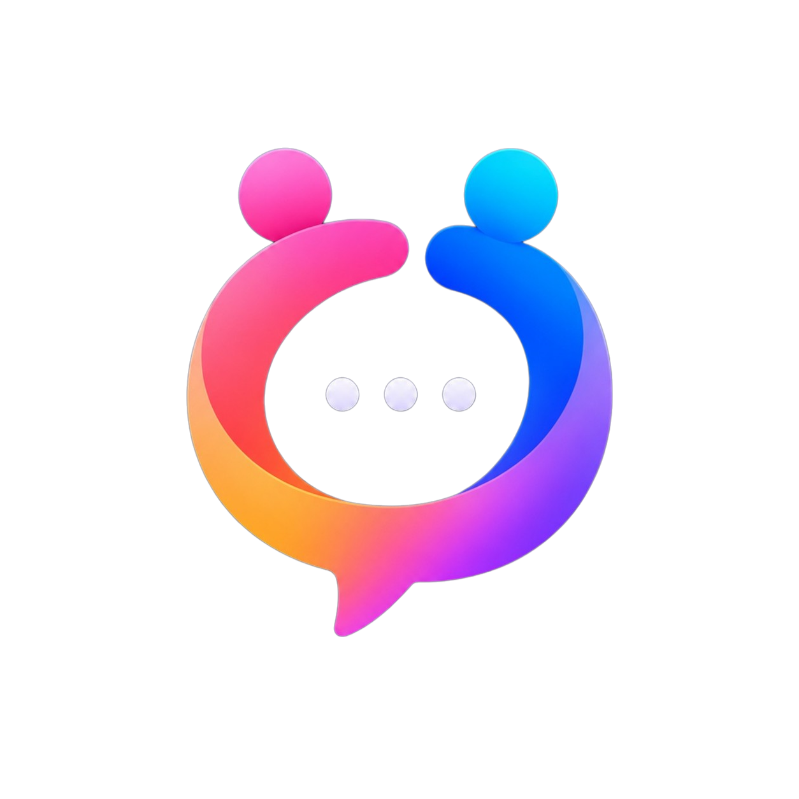

#  Sociyo

**Animations-First Social Media Experience**

> Tugas Besar Kelompok 1 — Pemrograman Mobile Lanjut  
> D3 Sistem Informasi · UPN Veteran Jakarta · 2026

---

## Tentang Sociyo

Sociyo adalah aplikasi social media mobile yang dibangun dengan React Native dan Expo, dirancang dengan pendekatan **animations-first**. Setiap interaksi pengguna — mulai dari scroll feed, like postingan, melihat story, hingga zoom foto — didukung oleh animasi native 60fps menggunakan React Native Reanimated 2 dan Gesture Handler.

Aplikasi ini bukan sekadar CRUD social media. Sociyo menghadirkan pengalaman visual yang hidup: story viewer dengan progress bar dan gesture pause/swipe, double-tap heart burst pada feed, pinch-to-zoom photo viewer dengan swipe dismiss, shared element hero transition, keyboard-aware composer, dan custom animated pull-to-refresh — semuanya berjalan pada UI thread tanpa blocking JavaScript.

---

## Tech Stack

| Layer | Teknologi |
| --- | --- |
| **Framework** | Expo SDK 56 · React Native 0.85 · TypeScript 6 |
| **Navigation** | React Navigation v7 — Stack, Bottom Tab, Drawer |
| **State Management** | Zustand 5 |
| **Backend** | Firebase Authentication · Cloud Firestore · Firebase Storage |
| **Push Notifications** | Expo Notifications · Expo Push API · FCM |
| **Animation** | React Native Reanimated 4 · React Native Gesture Handler 2 |
| **Image** | expo-image · expo-image-picker |
| **Offline** | AsyncStorage (feed cache per user) |
| **UI** | Lucide Icons · expo-linear-gradient · react-native-safe-area-context |

---

## Fitur Utama

### Fitur Minimum Social Media

- **Authentication** — Register, login email/password, Google Sign-In (native), forgot password, sesi persisten.
- **Profile Management** — Edit display name, username, bio, upload avatar.
- **Feed** — Infinite scroll dengan FlatList optimized dan pagination Firestore.
- **Create Post** — Upload foto dari galeri/kamera dengan caption dan lokasi.
- **Social** — Follow/unfollow (dual subcollection), like (optimistic update), comment thread.
- **Search & Discovery** — Prefix search user, explore grid 3×3 post populer.
- **Notifications** — Push notification untuk DM, activity bell real-time (follow/like/comment).
- **Offline Mode** — Feed tersimpan per akun di AsyncStorage, tampil saat tidak ada koneksi.
- **Dark / Light Mode** — Theme switching via `useThemeStore`.

### Fitur Unggulan Kelompok 1

#### 1.  Immersive Story Viewer
Story viewer layaknya Instagram: progress bar animasi auto-advance, tap kiri/kanan untuk navigasi, hold untuk pause, swipe horizontal antar pengguna, story ring gradient berputar untuk story belum ditonton, dan reply bottom sheet slide-up yang masuk ke DM real-time.

#### 2.  Animated Feed Micro-interactions
Double-tap to like dengan heart burst explosion, ikon like spring scale (`1 → 1.3 → 1`), like count lift animation, custom animated pull-to-refresh indicator (bukan spinner default), dan post card stagger fade-in saat pertama kali dimuat.

#### 3.  Interactive Photo Viewer
Pinch-to-zoom dengan `PinchGesture` + `PanGesture` simultaneous, double-tap to zoom toggle, swipe down dismiss dengan opacity fade, dan boundary clamping agar gambar tidak keluar layar.

#### 4.  Smooth Navigation Transitions
Shared element hero transition dari post card ke post detail, bottom tab animasi scale + color saat berpindah tab, dan keyboard-aware animated form pada comment composer dan DM composer menggunakan `useAnimatedKeyboard`.

---

## Arsitektur

```
┌─────────────────────────────────────────────────────┐
│                    React Native UI                   │
│         Screens · Components · Gesture Handler       │
├─────────────────────────────────────────────────────┤
│                   React Navigation                   │
│          Root Stack · Bottom Tab · Drawer            │
├─────────────────────────────────────────────────────┤
│                   Zustand Stores                     │
│   Auth · Post · Story · Follow · Message · Notif     │
├─────────────────────────────────────────────────────┤
│                   Service Layer                      │
│  post · story · follow · search · message · notif    │
│           feedCache · profile · activity             │
├──────────────┬──────────────┬────────────────────────┤
│  Firebase    │  Firebase    │  Firebase   │  Expo    │
│  Auth        │  Firestore   │  Storage    │  Push    │
└──────────────┴──────────────┴─────────────┴──────────┘
```

---

## Struktur Folder

```
AnimaVibeSocial/
├── src/
│   ├── components/         # Komponen reusable (AnimatedPostCard, Avatar, Screen, dll)
│   ├── hooks/              # Custom React hooks
│   ├── navigation/         # AppNavigator (Stack, Tab, Drawer)
│   ├── screens/
│   │   ├── auth/           # Login, Register, ForgotPassword
│   │   ├── catalog/        # AnimationCatalogScreen
│   │   ├── create/         # CreatePostScreen
│   │   ├── feed/           # FeedScreen, PostDetailScreen
│   │   ├── media/          # PhotoViewerScreen
│   │   ├── messages/       # MessagesScreen, MessageThreadScreen
│   │   ├── notifications/  # NotificationsScreen
│   │   ├── profile/        # ProfileScreen, EditProfile, UserProfile
│   │   ├── search/         # SearchScreen (user search + explore grid)
│   │   ├── settings/       # SettingsScreen (theme toggle)
│   │   └── story/          # StoryViewerScreen, CreateStoryScreen
│   ├── services/           # Firebase CRUD, push notification, feed cache
│   ├── store/              # Zustand stores (7 stores)
│   ├── theme/              # Color palette (dark + light)
│   ├── types/              # TypeScript types (social.ts, navigation.ts)
│   └── utils/              # Shared transition helpers
├── docs/                   # Dokumentasi teknis deliverable
├── assets/                 # Icon, splash, branding
├── android/                # Native Android build config
└── app.json                # Expo configuration
```

---

## Memulai Project

### Prasyarat

- Node.js ≥ 18
- npm atau yarn
- Android Studio (untuk emulator) atau perangkat Android fisik
- Expo development build (Google Sign-In dan push notification memerlukan native module)

### 1. Clone & Install

```bash
git clone https://github.com/radincuyy/Sociyo.git
cd Sociyo/AnimaVibeSocial
npm install
```

### 2. Konfigurasi Environment

Salin file `.env.example` menjadi `.env`, kemudian isi credential Firebase dari Firebase Console:

```bash
cp .env.example .env
```

| Variable | Keterangan |
| --- | --- |
| `EXPO_PUBLIC_FIREBASE_API_KEY` | API Key Firebase project |
| `EXPO_PUBLIC_FIREBASE_AUTH_DOMAIN` | Auth domain |
| `EXPO_PUBLIC_FIREBASE_PROJECT_ID` | Project ID |
| `EXPO_PUBLIC_FIREBASE_STORAGE_BUCKET` | Storage bucket |
| `EXPO_PUBLIC_FIREBASE_MESSAGING_SENDER_ID` | Messaging sender ID |
| `EXPO_PUBLIC_FIREBASE_APP_ID` | App ID |
| `EXPO_PUBLIC_GOOGLE_WEB_CLIENT_ID` | OAuth Client ID (tipe Web) untuk Google Sign-In |
| `EXPO_PUBLIC_GOOGLE_ANDROID_CLIENT_ID` | OAuth Client ID (tipe Android) |
| `EXPO_PUBLIC_GOOGLE_IOS_CLIENT_ID` | OAuth Client ID (tipe iOS) |
| `EXPO_PUBLIC_EAS_PROJECT_ID` | EAS Project ID untuk push notification |

### 3. Konfigurasi Firebase

#### Google Sign-In
1. Aktifkan provider **Google** di Firebase Authentication Console.
2. Buat OAuth Client ID tipe **Web** → isi ke `EXPO_PUBLIC_GOOGLE_WEB_CLIENT_ID`.
3. Buat OAuth Client ID tipe **Android** dengan package `com.radincuyy.sociyo` dan SHA-1 debug.
4. Gunakan **development build** (bukan Expo Go) karena Google Sign-In memerlukan native module.

#### Push Notification (FCM)
1. Unduh `google-services.json` dari Firebase Console (aplikasi Android dengan package `com.radincuyy.sociyo`).
2. Letakkan file di root project — `app.json` sudah mereferensikan `./google-services.json`.
3. Isi `EXPO_PUBLIC_EAS_PROJECT_ID` dari konfigurasi EAS.
4. Rebuild development build setiap konfigurasi native berubah.

### 4. Jalankan Aplikasi

```bash
# Development server
npx expo start --dev-client

# Atau langsung ke Android
npx expo run:android
```

### 5. Type Check

```bash
npm run typecheck
# atau
npx tsc --noEmit
```

---

## CRUD & API Operations

Project ini menggunakan Firebase sebagai backend. Terdapat **13 operasi CRUD/API** yang melebihi syarat minimum 8:

| # | Operasi | Service |
| --- | --- | --- |
| 1 | Register user | `useAuthStore` → Firebase Auth + Firestore |
| 2 | Login user | `useAuthStore` → Firebase Auth |
| 3 | Google Sign-In | `useAuthStore` → Google OAuth + Firebase Auth |
| 4 | Update profile | `profileService` → Firestore + Storage |
| 5 | Create post | `postService` → Firestore + Storage |
| 6 | Read feed (paginated) | `postService` → Firestore |
| 7 | Delete post | `postService` → Firestore + Storage |
| 8 | Toggle like | `postService` → Firestore |
| 9 | Add comment | `postService` → Firestore |
| 10 | Follow/unfollow | `followService` → Firestore batch |
| 11 | Create story | `storyService` → Firestore + Storage |
| 12 | Reply story → DM | `storyService` + `messageService` → Firestore + Push |
| 13 | Send direct message | `messageService` → Firestore + Push |

Dokumentasi lengkap: [`docs/api-crud.md`](docs/api-crud.md)

---

## Animasi & Gesture

Sociyo mengimplementasikan **20+ animasi** (syarat minimum 3) dan **3 gesture compositions** (syarat minimum 2), semuanya menggunakan Reanimated 2 — tanpa React Native `Animated` API.

| Komposisi | Scene | Gesture |
| --- | --- | --- |
| `Gesture.Exclusive` | Feed image | Single tap (photo viewer) vs double tap (like) |
| `Gesture.Simultaneous` | Story viewer | Horizontal pan + long press pause |
| `Gesture.Simultaneous` | Photo viewer | Pinch + pan + double tap zoom |

Katalog lengkap semua animasi: [`docs/animation-catalog.md`](docs/animation-catalog.md)

---

## Dokumentasi Deliverable

| Deliverable | Dokumen |
| --- | --- |
| D1-1 Source Code | Repository ini |
| D1-2 Animation Catalog | [`docs/animation-catalog.md`](docs/animation-catalog.md) |
| D1-3 Performance Report | [`docs/performance-report.md`](docs/performance-report.md) |
| D1-4 Demo Script | [`docs/demo-script.md`](docs/demo-script.md) |
| Architecture Documentation | [`docs/architecture.md`](docs/architecture.md) |
| Firestore Schema | [`docs/firestore-schema.md`](docs/firestore-schema.md) |
| API & CRUD Documentation | [`docs/api-crud.md`](docs/api-crud.md) |
| User Manual | [`docs/user-manual.md`](docs/user-manual.md) |
| Test Report | [`docs/test-report.md`](docs/test-report.md) |
| Submission Checklist | [`docs/submission-checklist.md`](docs/submission-checklist.md) |
| Presentation Outline | [`docs/presentation-slides.md`](docs/presentation-slides.md) |

---

## Branch Strategy

| Branch | Fungsi |
| --- | --- |
| `main` | Production — kode stabil untuk demo dan penilaian |
| `develop` | Development — integrasi semua fitur sebelum merge ke main |

---

## Tim Pengembang

**Kelompok 1** — D3 Ilmu Komputer, UPN Veteran Jakarta

| Nama | NIM | Peran |
| --- | --- | --- |
| Radinka Alifasya Dinova | 2410501073 | Project Manager, Full-Stack Developer, Auth, Firebase, Architecture |
| Muhammad Ragil Hardika | 2410501103 | UI/UX Designer, Frontend Auth/Feed/Profile/Story |
| Rheyvana Nasya Dzanuard | 2410501133 | Frontend Developer, Documentation, System Analyst |
| Novry Nanda Kurnia Putra | 2410501123 | Backend Integrator, QA, Firestore, Testing, Docs |

---

## Lisensi

Project ini dibuat untuk keperluan akademik mata kuliah Pemrograman Mobile Lanjut, UPN Veteran Jakarta.
