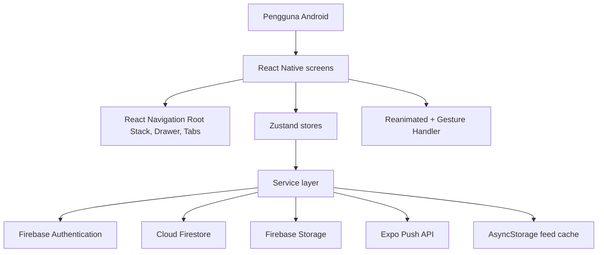

# Architecture Documentation

Tanggal audit: 28 Juni 2026.

Dokumen ini menjelaskan arsitektur teknis Sociyo untuk deliverable technical documentation.

## Ringkasan

Sociyo adalah aplikasi social media mobile berbasis Expo dan React Native. Aplikasi memakai Firebase sebagai backend utama, Zustand sebagai state management, React Navigation untuk struktur layar, Reanimated dan Gesture Handler untuk pengalaman animations-first, serta AsyncStorage untuk cache feed offline.

## Layer Aplikasi

| Layer | Lokasi | Tanggung jawab |
| --- | --- | --- |
| Entry point | `App.tsx`, `index.ts` | Bootstrap app, provider, dan integrasi navigation container. |
| Navigation | `src/navigation/AppNavigator.tsx` | Auth stack, root stack, bottom tab, drawer, deep navigation antar fitur. |
| Screens | `src/screens/**` | UI utama untuk auth, feed, post detail, story, DM, profile, search, settings, notification. |
| Components | `src/components/**` | Komponen reusable seperti avatar, button, input, post card, refresh indicator, story bubble. |
| Stores | `src/store/**` | State client menggunakan Zustand untuk auth, post, story, follow, message, notification, theme. |
| Services | `src/services/**` | Operasi Firebase, Storage upload, push token, search, DM, dan cache offline. |
| Types | `src/types/**` | Kontrak data UI, navigation params, post, story, comment, message, notification. |
| Theme | `src/theme/colors.ts` | Palet light/dark dan token warna aplikasi. |

## Struktur Navigasi

| Navigator | Isi |
| --- | --- |
| Auth Stack | Login, Register, Forgot Password. |
| Main Drawer | HomeTabs, Animation Catalog, Settings. |
| Bottom Tabs | Feed, Pesan, Create, Search, Profile. |
| Root Stack | Main, Notifications, CreateStory, EditProfile, UserProfile, MessageThread, PostDetail, StoryViewer, PhotoViewer. |

Catatan: timeline PDF menyebut React Navigation v6, sedangkan project saat ini memakai React Navigation v7. Struktur navigator wajib tetap terpenuhi: Stack, Tab, dan Drawer sudah digunakan.

## State Management

| Store | Tanggung jawab utama |
| --- | --- |
| `useAuthStore` | Sesi Firebase Auth, register/login/logout/reset password, Google Sign-In, update profil, upload avatar. |
| `usePostStore` | Feed, pagination, create/delete post, like, comments, offline cache status. |
| `useStoryStore` | Story groups, create story, mark viewed, story reply ke DM. |
| `useFollowStore` | Status follow/unfollow dan toggle follow pengguna. |
| `useMessageStore` | Realtime thread, realtime messages, unread count, send text message, mark read. |
| `useNotificationStore` | Push token registration, local test notification, realtime activity notification. |
| `useThemeStore` | Mode light/dark. |

## Alur Data Utama

1. Auth:
   User login atau register lewat Firebase Auth. Setelah berhasil, `useAuthStore` memastikan dokumen `users/{uid}` tersedia di Firestore.

2. Feed:
   `FeedScreen` memanggil `usePostStore.fetchPosts`. Store membaca Firestore lewat `postService.getPosts`, lalu menyimpan snapshot ke AsyncStorage. Jika offline, store membaca cache lewat `feedCache`.

3. Create Post:
   `CreatePostScreen` memilih gambar dengan image picker, lalu `postService.createPost` upload gambar ke Firebase Storage dan membuat dokumen `posts/{postId}`.

4. Social:
   Like dan comment memperbarui subcollection `posts/{postId}/likes` atau `posts/{postId}/comments`, menaikkan counter, dan membuat activity notification jika target bukan diri sendiri.

5. Story:
   `CreateStoryScreen` upload story ke Storage, membuat `stories/{storyId}` dengan `expiresAt` 24 jam. `StoryViewerScreen` memuat group aktif, menandai viewed, dan mengirim reply ke DM.

6. DM:
   Thread DM memakai `threads/{threadId}` dan subcollection `messages`. Pesan realtime memakai `onSnapshot`. Reply story memakai message kind `story_reply` dan tampil di DM, bukan bell notification.

7. Push Notification:
   Settings mendaftarkan Expo push token ke `users/{uid}`. Saat DM terkirim, `messageService` membaca token penerima lalu mengirim push via Expo Push API.

## Dependency Kunci

| Dependency | Peran |
| --- | --- |
| Expo SDK 56 | Runtime mobile dan tooling project. |
| Firebase Web SDK | Authentication, Firestore, Storage. |
| React Navigation v7 | Stack, Tab, Drawer. |
| Zustand | Client state management. |
| Reanimated 4.x | Animasi UI dengan API Reanimated. |
| Gesture Handler | Double tap, pan, pinch, long press, gesture composition. |
| expo-image | Rendering gambar yang lebih optimal. |
| expo-notifications | Local notification, push token, notification channel. |
| AsyncStorage | Cache feed offline. |

## Risiko Teknis

| Risiko | Dampak | Mitigasi saat ini |
| --- | --- | --- |
| Push notification butuh development build dan FCM credentials | Expo Go tidak cukup untuk validasi FCM Android | `google-services.json`, `EXPO_PUBLIC_EAS_PROJECT_ID`, dan EAS FCM credentials perlu siap sebelum demo. |
| Metrik performa belum diambil dari perangkat fisik | Performance report belum punya angka final FPS/JS/UI thread | Dokumen performa menyediakan skenario dan tabel pengukuran yang tinggal diisi saat profiling perangkat. |
| Query Firestore menghindari composite index | Sorting sebagian dilakukan client-side | Cocok untuk skala tugas besar, perlu indeks khusus jika data bertambah besar. |
| React Navigation v7 berbeda dari requirement v6 | Bisa jadi pertanyaan saat review | Jelaskan struktur navigator sudah sama, atau downgrade jika dosen meminta versi literal. |

